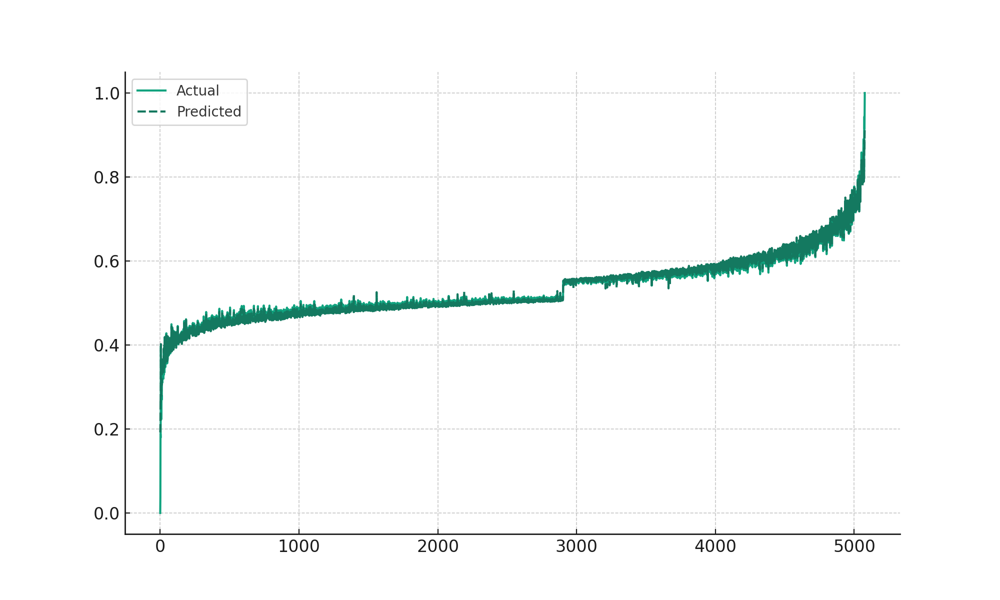
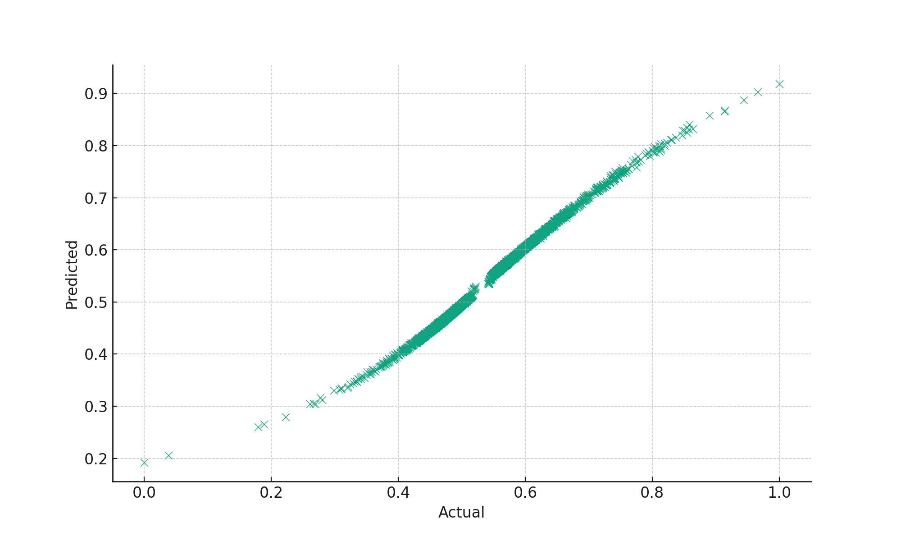
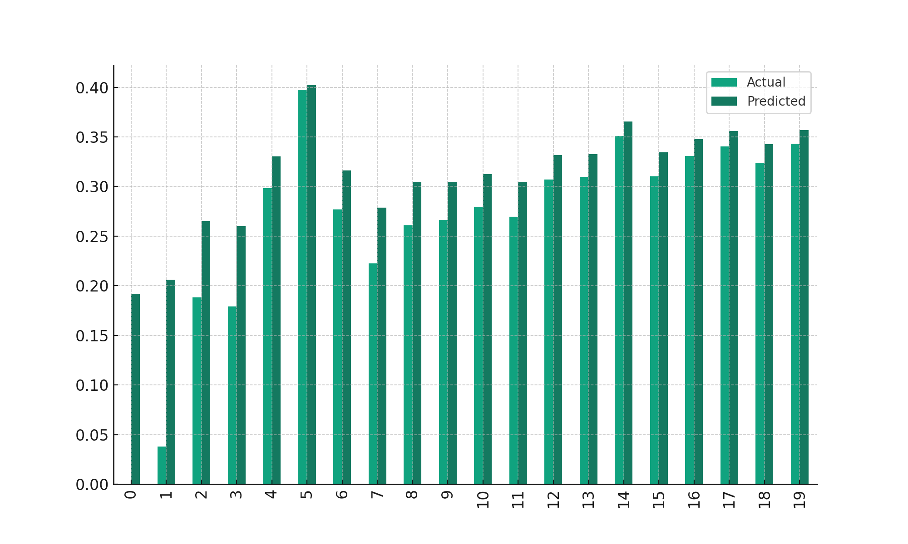
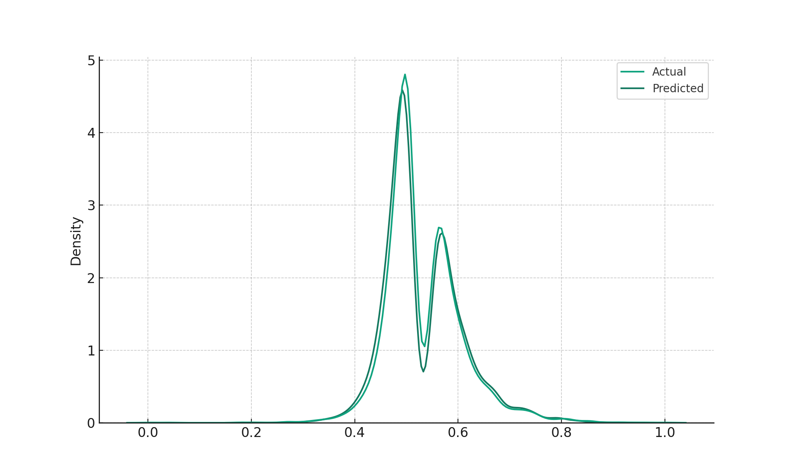
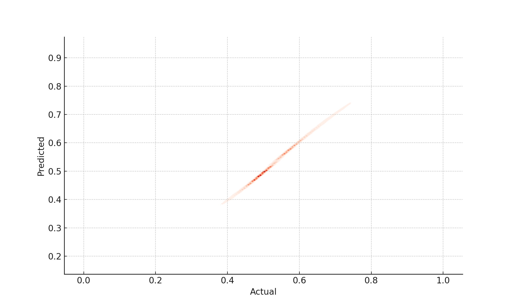

# Comparative Machine Learning Analysis in Bioinformatics

## Introduction
This project focuses on comparative machine learning analysis in the field of bioinformatics, specifically examining gene expression data. The analysis involves various machine learning techniques, 
including Random Forest, Support Vector Regression (SVR), and other regression models, to predict and analyze gene expression scores.

## Technologies and Libraries Used
- **Python**: Used for data preprocessing, model building, and evaluation.
  - Key Libraries: `pandas`, `numpy`, `sklearn`, `seaborn`, `matplotlib`
- **R**: Employed for statistical analysis and visualization.
  - Key Libraries: `tidyverse`, `caret`, `e1071`, `rpart`, `randomForest`, `ggplot2`, `readr`, `ggpubr`

## Data Description
(Include a brief description of the data used in your project, its source, and any preprocessing steps you performed.)

## Machine Learning Models and Techniques
(Describe the various machine learning models and techniques used in your analysis, such as Random Forest, SVR, feature selection methods, etc.)

## Visualizations
The following visualizations represent key insights from our analysis:

### Line Plot

(A brief description of what the line plot represents and insights derived from it.)

### Scatter Plot

(Explanation of the scatter plot findings and its significance in your analysis.)

### Bar Chart

(Details about the data shown in the bar chart and how it relates to your project's goals.)

### Density Plot

(Interpretation of the density plot and what it reveals about your data.)

### Joint Density Plot

(Insights from the joint density plot and its relevance to the gene expression analysis.)

## Results and Discussion
(Summarize the key findings of your project, any interesting patterns or observations from the analysis, and potential implications of these results.)

## Installation and Setup
(Provide instructions on how to set up and run your project, including any necessary dependencies and environment setup.)

## Usage
(Detail how to use the project, including how to run the scripts and utilize the analysis.)

## Contributing
(Information on how others can contribute to the project, if applicable.)

## Contact
For more information or inquiries, please contact [Your Contact Information].

---

(Feel free to add or modify sections as necessary for your project.)

